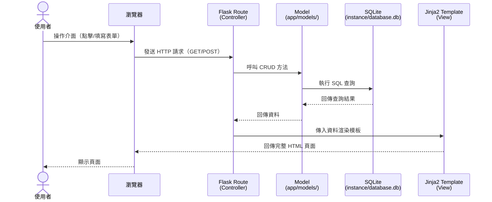
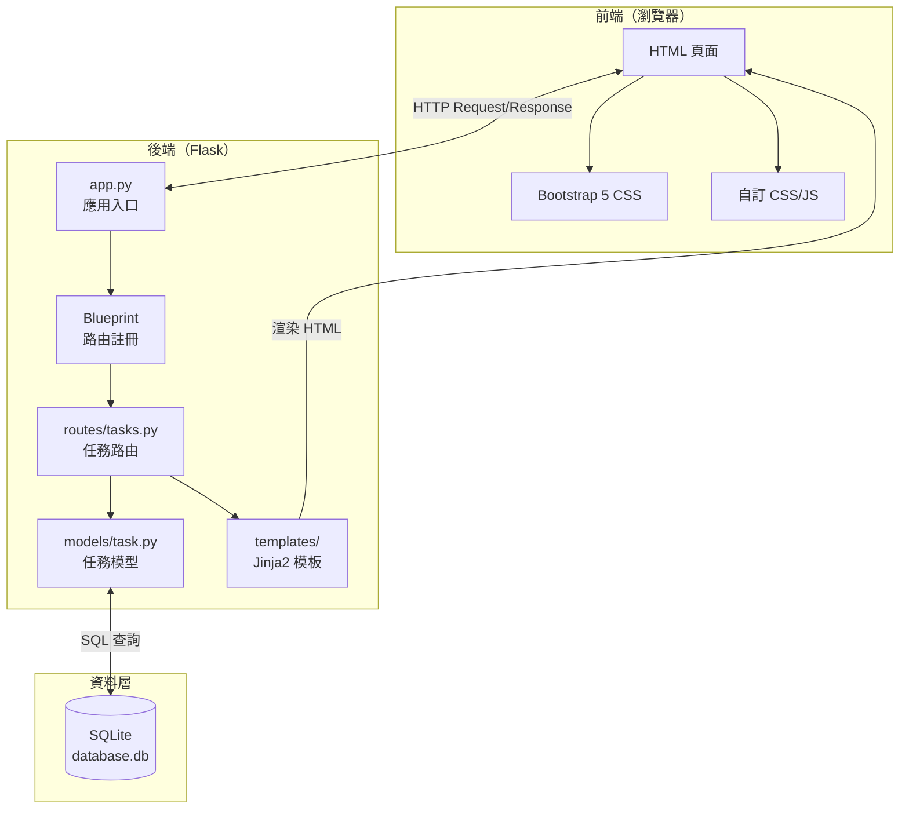

# 系統架構設計 — 任務管理系統

## 1. 技術架構說明

### 1.1 選用技術與原因

| 技術 | 角色 | 選用原因 |
|------|------|----------|
| **Python + Flask** | 後端 Web 框架 | 輕量、易學，適合快速開發中小型應用 |
| **Jinja2** | 模板引擎（View） | Flask 內建，語法直覺，可直接在 HTML 中嵌入 Python 邏輯 |
| **SQLite** | 資料庫 | 不需額外安裝，單檔案即可運作，適合開發與小型專案 |
| **Bootstrap 5** | 前端 CSS 框架 | 透過 CDN 引入，快速產出美觀且響應式的介面 |

### 1.2 Flask MVC 模式說明

本專案採用 **MVC（Model-View-Controller）** 架構模式，將程式碼依職責分離：

```
┌─────────────────────────────────────────────────────────┐
│                     使用者瀏覽器                          │
│              （發送 HTTP 請求 / 顯示頁面）                 │
└────────────────────────┬────────────────────────────────┘
                         │
                         ▼
┌─────────────────────────────────────────────────────────┐
│              Controller（控制器）                         │
│              app/routes/*.py                             │
│                                                         │
│  · 接收使用者的 HTTP 請求（GET / POST）                    │
│  · 進行輸入驗證                                          │
│  · 呼叫 Model 存取資料                                   │
│  · 決定要渲染哪個 View（模板）或重導向                     │
└───────┬─────────────────────────────────┬───────────────┘
        │                                 │
        ▼                                 ▼
┌───────────────────┐     ┌───────────────────────────────┐
│  Model（模型）     │     │  View（視圖）                  │
│  app/models/*.py   │     │  app/templates/*.html          │
│                    │     │                                │
│  · 定義資料結構     │     │  · Jinja2 HTML 模板            │
│  · 封裝 CRUD 操作  │     │  · 接收 Controller 傳來的資料   │
│  · 與 SQLite 互動  │     │  · 動態產生最終 HTML 頁面       │
└────────┬───────────┘     └───────────────────────────────┘
         │
         ▼
┌────────────────────┐
│  SQLite 資料庫      │
│  instance/         │
│  database.db       │
└────────────────────┘
```

| 層級 | 位置 | 職責 |
|------|------|------|
| **Model** | `app/models/` | 定義資料結構與資料庫操作（CRUD），封裝所有 SQL 查詢 |
| **View** | `app/templates/` | Jinja2 HTML 模板，負責頁面呈現與使用者互動 |
| **Controller** | `app/routes/` | Flask 路由函式，接收請求、呼叫 Model、回傳 View |

---

## 2. 專案資料夾結構

```
web_app_development2/
│
├── app.py                    ← 應用程式入口點（建立 Flask app、註冊 Blueprint、初始化 DB）
├── requirements.txt          ← Python 套件相依清單
├── .env.example              ← 環境變數範本（SECRET_KEY 等）
│
├── app/                      ← 應用程式主要程式碼
│   ├── __init__.py           ← app 套件初始化
│   │
│   ├── models/               ← Model 層：資料庫模型
│   │   ├── __init__.py
│   │   └── task.py           ← Task 資料表的 CRUD 操作
│   │
│   ├── routes/               ← Controller 層：Flask 路由（Blueprint）
│   │   ├── __init__.py
│   │   └── tasks.py          ← 任務相關的所有路由
│   │
│   ├── templates/            ← View 層：Jinja2 HTML 模板
│   │   ├── base.html         ← 基礎模板（導覽列、CSS/JS 引入、flash 訊息）
│   │   └── tasks/            ← 任務相關頁面
│   │       ├── index.html    ← 任務列表頁（首頁）
│   │       ├── new.html      ← 新增任務表單
│   │       ├── detail.html   ← 任務詳情頁
│   │       └── edit.html     ← 編輯任務表單
│   │
│   └── static/               ← 靜態資源
│       ├── css/
│       │   └── style.css     ← 自訂樣式
│       └── js/
│           └── main.js       ← 自訂 JavaScript
│
├── database/                 ← 資料庫相關檔案
│   └── schema.sql            ← SQL 建表語法
│
├── instance/                 ← Flask 實例資料夾（自動建立）
│   └── database.db           ← SQLite 資料庫檔案（不納入版本控制）
│
├── docs/                     ← 設計文件
│   ├── PRD.md                ← 產品需求文件
│   ├── ARCHITECTURE.md       ← 系統架構設計（本文件）
│   ├── FLOWCHART.md          ← 流程圖
│   ├── DB_DESIGN.md          ← 資料庫設計
│   └── ROUTES.md             ← 路由設計
│
└── .agents/                  ← AI Agent Skill 設定（已預設）
    └── skills/
```

### 各資料夾用途說明

| 資料夾/檔案 | 用途 |
|-------------|------|
| `app.py` | 程式進入點。建立 Flask 應用實體、設定 secret key、註冊 Blueprint、提供資料庫初始化功能 |
| `app/models/` | 放置資料庫模型。每個資料表一個 `.py` 檔，封裝 CRUD 方法 |
| `app/routes/` | 放置路由（Controller）。使用 Flask Blueprint 組織，每個功能模組一個 `.py` 檔 |
| `app/templates/` | 放置 Jinja2 HTML 模板。`base.html` 為基礎模板，其他頁面繼承它 |
| `app/static/` | 放置 CSS、JavaScript 等靜態資源 |
| `database/` | 放置 SQL schema 檔案，用於初始化或重建資料庫 |
| `instance/` | Flask 實例資料夾，放置 SQLite 資料庫檔案（不上傳到 Git） |
| `docs/` | 放置所有設計文件 |

---

## 3. 元件關係圖

### 3.1 請求處理流程



### 3.2 系統元件總覽



---

## 4. 關鍵設計決策

### 決策 1：使用 sqlite3 而非 SQLAlchemy

| 項目 | 說明 |
|------|------|
| **決策** | 使用 Python 內建的 `sqlite3` 模組 |
| **原因** | 本專案資料表簡單（只有 1 張 Task 表），使用 ORM 框架反而增加學習成本。直接寫 SQL 更直覺，也有助於理解資料庫操作原理。 |

### 決策 2：使用 Flask Blueprint 組織路由

| 項目 | 說明 |
|------|------|
| **決策** | 將路由放在 `app/routes/` 並使用 Blueprint 註冊 |
| **原因** | 即使只有一個功能模組，使用 Blueprint 可以保持程式碼結構清晰，未來新增功能時也容易擴展。 |

### 決策 3：模板繼承（Template Inheritance）

| 項目 | 說明 |
|------|------|
| **決策** | 所有頁面繼承 `base.html` 基礎模板 |
| **原因** | 避免重複撰寫導覽列、CSS 引入、Flash 訊息區塊等共用元素。修改共用部分時只需改一個檔案。 |

### 決策 4：Bootstrap 5 透過 CDN 引入

| 項目 | 說明 |
|------|------|
| **決策** | 使用 CDN 方式載入 Bootstrap 5，不安裝到本機 |
| **原因** | 減少專案檔案大小，簡化部署流程。本專案為開發練習，不需要離線支援。 |

### 決策 5：資料庫檔案放在 instance/ 資料夾

| 項目 | 說明 |
|------|------|
| **決策** | SQLite 資料庫檔案放在 `instance/database.db` |
| **原因** | Flask 建議將實例相關的檔案放在 `instance/` 資料夾，此資料夾預設不會被納入版本控制（已加入 `.gitignore`），避免不同開發者的資料衝突。 |

---

*文件版本：v1.0*  
*建立日期：2026-04-23*  
*最後更新：2026-04-23*
