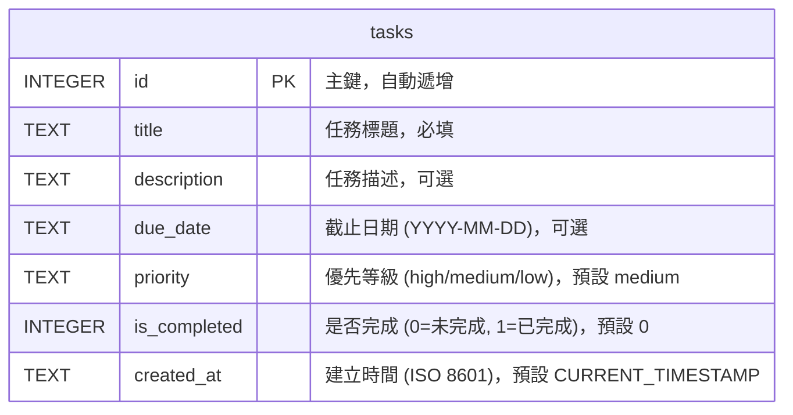

# 資料庫設計 — 任務管理系統

## 1. ER 圖（實體關係圖）

本系統為輕量級任務管理工具，目前僅需一個 `tasks` 資料表來儲存所有任務資料。

## 2. 資料表詳細說明

### `tasks` 資料表

負責儲存使用者建立的所有待辦事項。

| 欄位名稱 | 型別 | 鍵 | 必填 | 預設值 | 說明 |
|----------|------|----|------|--------|------|
| `id` | INTEGER | PK | 是 | (自動遞增) | 任務唯一識別碼 |
| `title` | TEXT | - | 是 | - | 任務的簡短標題 |
| `description` | TEXT | - | 否 | NULL | 任務的詳細說明 |
| `due_date` | TEXT | - | 否 | NULL | 任務截止日期，格式 `YYYY-MM-DD` |
| `priority` | TEXT | - | 是 | 'medium' | 優先等級，可選值：`high`, `medium`, `low` |
| `is_completed` | INTEGER | - | 是 | 0 | 完成狀態：`0` (未完成)，`1` (已完成)。SQLite 沒有 BOOLEAN，以 INTEGER 代替 |
| `created_at` | TEXT | - | 是 | CURRENT_TIMESTAMP | 任務建立的時間戳記 |

---

*文件版本：v1.0*  
*建立日期：2026-04-23*  
*最後更新：2026-04-23*
