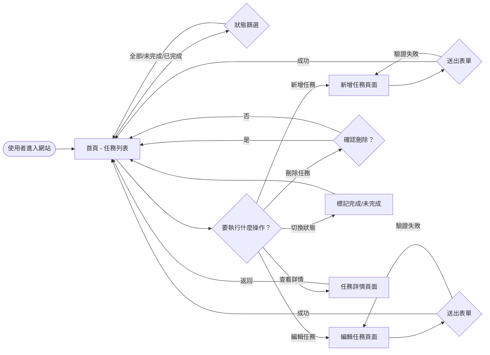
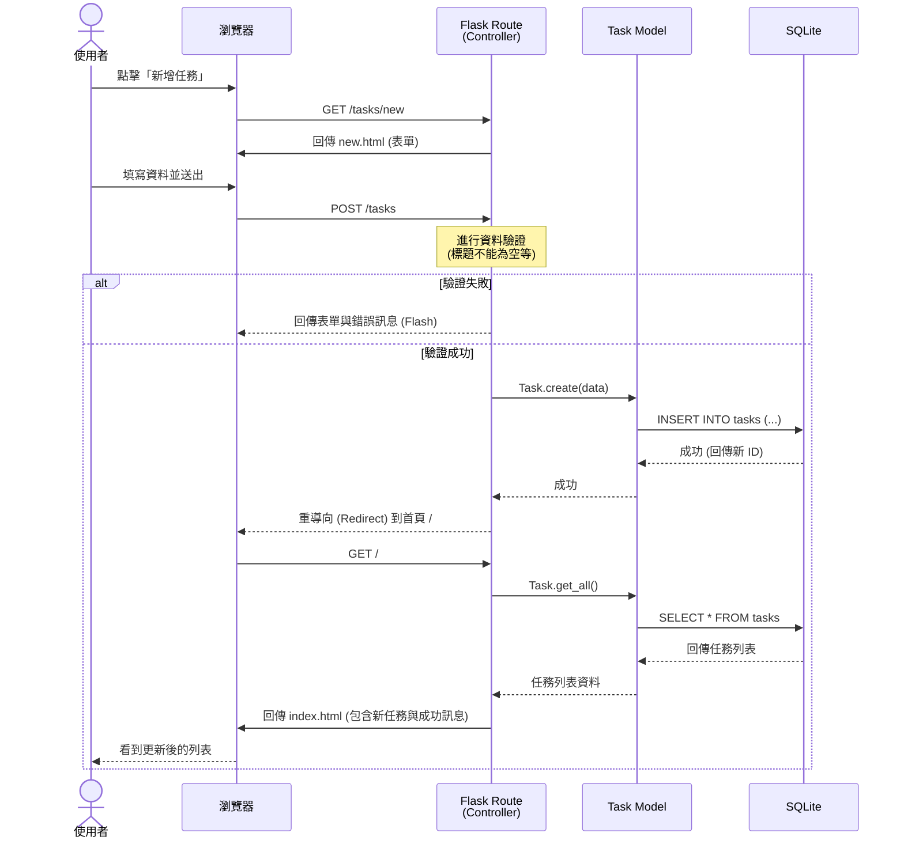

# 流程圖設計 — 任務管理系統

## 1. 使用者流程圖（User Flow）

此流程圖展示使用者在系統中的操作路徑與頁面跳轉邏輯。

---

## 2. 系統序列圖（Sequence Diagram）

此序列圖以「新增任務」為例，展示從使用者操作到資料庫儲存的完整系統互動過程。

---

## 3. 功能清單對照表

以下表格對應了 PRD 中的功能需求與實際的 HTTP 路由設計。

| 功能編號 | 功能名稱 | HTTP 方法 | URL 路徑 | 對應動作 |
|----------|----------|-----------|----------|----------|
| F01 | 任務列表 | GET | `/` 或 `/tasks` | 顯示所有任務，渲染 `index.html` |
| F02 | 新增任務頁面 | GET | `/tasks/new` | 顯示新增表單，渲染 `new.html` |
| F02 | 建立任務 | POST | `/tasks` | 接收表單資料，存入 DB，重導向回首頁 |
| F06 | 任務詳情 | GET | `/tasks/<int:id>` | 顯示單筆任務，渲染 `detail.html` |
| F03 | 編輯任務頁面 | GET | `/tasks/<int:id>/edit` | 顯示編輯表單，渲染 `edit.html` |
| F03 | 更新任務 | POST | `/tasks/<int:id>/update` | 接收表單資料，更新 DB，重導向回首頁 |
| F04 | 刪除任務 | POST | `/tasks/<int:id>/delete` | 從 DB 刪除該筆資料，重導向回首頁 |
| F05 | 標記完成 | POST | `/tasks/<int:id>/toggle` | 切換該筆任務的完成狀態，重導向回首頁 |

> **說明：**
> - 在 HTML 原生表單中只支援 `GET` 和 `POST` 方法，因此更新、刪除與切換狀態等操作皆使用 `POST` 方法，而非 RESTful 標準中的 `PUT`/`PATCH`/`DELETE`。
> - 狀態篩選 (F07) 可以透過在列表頁的 URL 加上查詢參數來實現，例如：`/?status=completed`。

---

*文件版本：v1.0*  
*建立日期：2026-04-23*  
*最後更新：2026-04-23*
